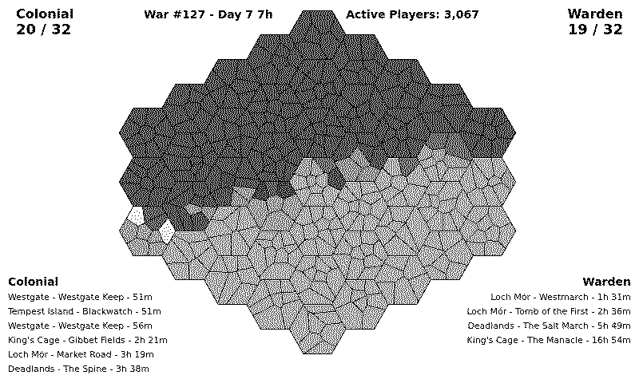
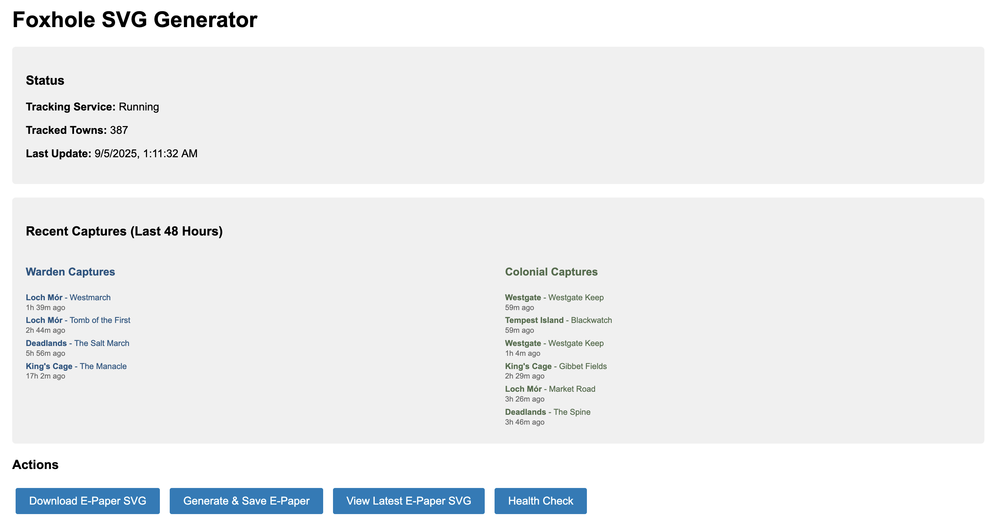
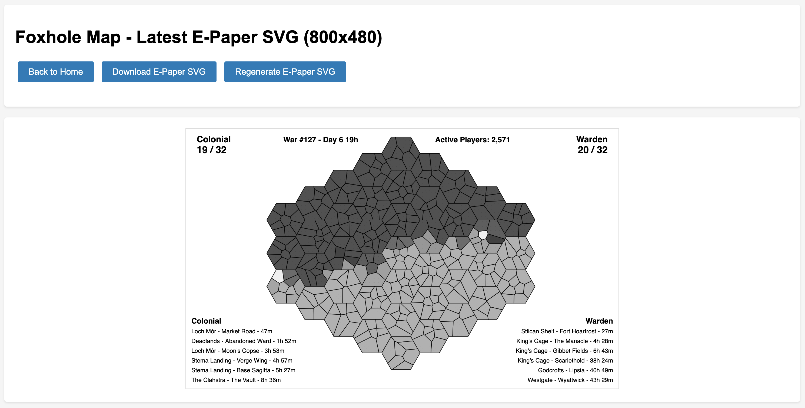

# Foxhole TRMNL Dashboard

A Docker container that generates real-time SVG maps of Foxhole war status, optimized for e-paper displays and Terminus servers.

## What This Project Does

This project creates beautiful, real-time maps of the Foxhole war by:

- **📊 Tracking War Data**: Monitors town control changes every 5 minutes using the official Foxhole API
- **🗺️ Generating Maps**: Creates high-quality SVG maps with accurate team control visualization
- **📱 E-Paper Ready**: Optimizes maps for small, grayscale displays with high contrast
- **🌐 Web Interface**: Provides a live dashboard to monitor war progress and recent captures
- **📡 Terminus Integration**: Automatically posts updated maps to your [Terminus](https://github.com/usetrmnl/byos_hanami) server
- **⏰ Real-Time Updates**: Shows recent town captures with exact timestamps and locations

## Screenshots

### Terminus Dashboard


### Web Interface - War Overview


### Web Interface - Recent Captures


## Quick Start

### 1. Setup Environment
```bash
# Copy environment template
cp env.example .env
# Edit .env with your Terminus server details
```

### 2. Start the Service
```bash
# Build and start everything
docker-compose up -d

# Or build manually
docker build -t foxhole-svg .
docker run -d --name foxhole-svg -p 3000:3000 --env-file .env foxhole-svg
```

### 3. Access the Web Interface
Visit `http://localhost:3000` to:
- View real-time war status
- Monitor recent captures
- Generate and download SVG maps

## Features

- **Accurate Sub-region Coloring**: Recently captured regions are easily identifiable as they appear lighter and get darker over 48 hours
- **Town Control Tracking**: SQLite database tracks real `lastChange` timestamps
- **Live Data Updates**: Background service updates every 5 minutes
- **E-paper Optimized**: High contrast colors and clear typography for small displays
- **Single Container**: Everything runs in one Docker container
- **Web Interface**: Easy-to-use UI for map generation and monitoring
- **API Endpoints**: Programmatic access to all features
- **Terminus Integration**: Automatic posting to Terminus server with fresh data
- **Recent Captures Display**: Live tracking of town captures with hex and region names

## Terminus Integration

The project automatically posts to your Terminus server whenever fresh Foxhole data is available.

### Setup
1. Create `.env` file with your Terminus details:
   ```bash
   TERMINUS_URL=https://your-terminus-server.com
   TERMINUS_LOGIN=your_email@example.com
   TERMINUS_PASSWORD=your_password
   TERMINUS_BIT_DEPTH=1
   ```

   **Note**: For Terminus 0.30.0+, you need to create a user account via the web UI first. The old `DEVICE_API_KEY` authentication method is no longer supported.
   
   **Bit Depth Options**:
   - `1` = Black/white only (optimal for e-paper)
   - `2` = 4 gray levels
   - `3` = 8 gray levels

2. Start the service - Terminus posting happens automatically!

### What It Does
- **Waits for fresh data** from the tracking service
- **Generates e-paper SVG** with current war status
- **Creates HTML dashboard** with embedded SVG and war statistics
- **Posts to Terminus server** via REST API
- **Updates existing screen** or creates new one

## API Endpoints

When running the web server:
- `GET /` - Web interface
- `GET /health` - Health check
- `POST /api/generate-epaper-svg` - Generate and save e-paper SVG map
- `GET /api/generate-epaper-svg` - Download e-paper SVG map
- `GET /api/conquerStatus` - Get current tracking data
- `GET /api/recent-captures` - Get enriched recent captures data

## Output

- **E-paper SVG**: `output/foxhole-map-epaper-YYYY-MM-DD.svg`
- **Latest e-paper**: `output/latest-epaper.svg`
- **HTML Dashboard**: Automatically posted to Terminus server
- **Database**: Town control data in `data/towns.db`

## File Structure

```
foxhole-svg/
├── Dockerfile                    # Container definition
├── docker-compose.yml           # Single container setup
├── package.json                 # Dependencies & scripts
├── src/
│   ├── generate-svg.js          # Main SVG generation logic
│   ├── warapi.js               # Foxhole War API client
│   ├── server-with-tracking.js  # Combined web server + tracking
│   ├── data-updater.js         # Background data tracking service
│   ├── database.js             # SQLite database management
│   └── terminus-poster.js      # Terminus server integration
├── public/
│   └── static.json             # Static map data
├── output/                      # Generated SVG files
├── data/                        # SQLite database files
└── imgs/                        # Screenshots
```

## Technical Details

- **Node.js 20+** runtime
- **Foxhole War API** for live game data
- **SVG generation** optimized for e-paper displays
- **Express.js** web server for API endpoints
- **SQLite** database for town control tracking
- **Docker** containerization for easy deployment

## Troubleshooting

### Service Won't Start
- Check if port 3000 is available
- Verify Foxhole API is accessible
- Check logs: `docker-compose logs`

### No Alpha Variation
- Ensure tracking service is running
- Check database has data in `data/towns.db`
- Verify town coordinates match between API and database

### Terminus Issues
- Verify `.env` file has correct `TERMINUS_URL`, `TERMINUS_LOGIN`, and `TERMINUS_PASSWORD`
- Check Terminus server is accessible
- Review logs for API errors
